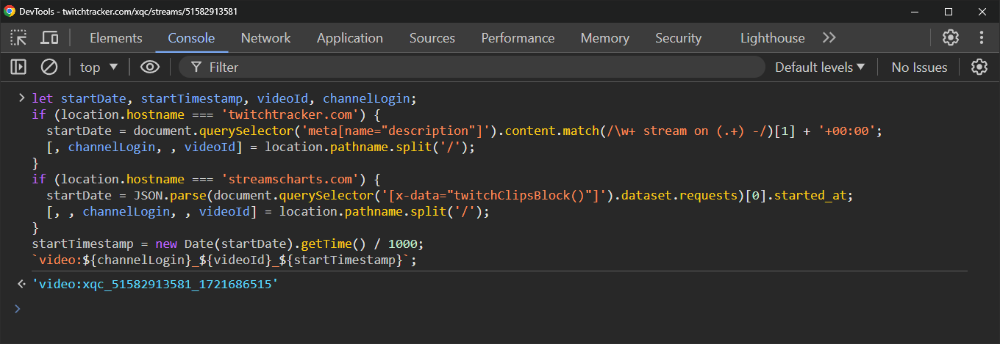

# Download Twitch Private Videos

> [!IMPORTANT]
> This tutorial is only relevant for finished streams.
>
> If You want to download hidden VOD which is currently live, just use a channel link and `--live-from-start` option.
>
> It's not possible to download if:
>
> - A VOD is older than 7 days (14 days for Affiliates, 60 days for Partners, Turbo and Prime users);
> - A VOD was manually deleted via Video Producer in the Twitch Dashboard;
> - A channel didn't enable "Store past broadcasts" option.

## Step 1

Go to one of these websites.

```bash
https://twitchtracker.com/%channel_name%/streams
https://streamscharts.com/channels/%channel_name%/streams

# examples
https://twitchtracker.com/xqc/streams
https://streamscharts.com/channels/lirik/streams
```

## Step 2

Find the stream page for which you want to download the VOD.

```bash
# examples
https://twitchtracker.com/xqc/streams/51582913581
https://streamscharts.com/channels/lirik/streams/51579711693
```

## Step 3

Open the Developer Tools in your browser on that page (press `F12` or `Ctrl+Shift+I` or Right Click -> Inspect)

Switch to the Console tab.

Copy and paste the following code to the console.

```js
let startDate, startTimestamp, videoId, channelLogin;
if (location.hostname === 'twitchtracker.com') {
  startDate = document.querySelector('meta[name="description"]').content.match(/\w+ stream on (.+) -/)[1];
  [, channelLogin, , videoId] = location.pathname.split('/');
}
if (location.hostname === 'streamscharts.com') {
  const comp = livewire.components.components().find((c) => c.serverMemo.data.stream); 
  startDate = comp.serverMemo.data.stream.stream_created_at;
  [, , channelLogin, , videoId] = location.pathname.split('/');
}
startTimestamp = new Date(startDate + '+00:00').getTime() / 1000;
`video:${channelLogin}_${videoId}_${startTimestamp}`;
```

Press `Enter`.

Example:



## Step 4

Use the result from the previous step to download the VOD with [twitch-dlp](https://github.com/DmitryScaletta/twitch-dlp).

```bash
# examples
npx twitch-dlp video:xqc_51582913581_1721686515
npx twitch-dlp video:lirik_51579711693_1721664413
```

## FAQ

Q: Is it automatable?  
A: Unfortunately no. Both twitchtracker.com and streamscharts.com are using anti DDOS protection, so it's not easy to retrieve the HTML content of these pages.

Q: Can you add support for sullygnome.com?  
A: It's not possible because they don't show seconds when the stream started (only hours and minutes).

Q: Why is VOD only partially downloaded?  
A: It can happen if there was a disconnect during the broadcast or if a streamer ended the broadcast and started it again in a few minutes. Twitchtracker combine these streams into one and only store information about the first one. So use streamscharts instead.
