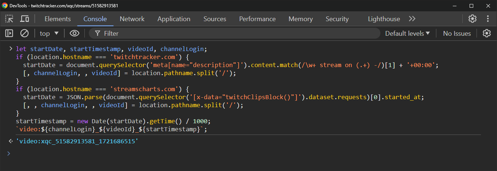

# Download Twitch Private Videos

> [!IMPORTANT]
> This tutorial is only relevant for finished streams.
>
> If you want to download a hidden VOD which is currently live, just use a channel link and `--live-from-start` option.
>
> It's not possible to download if:
>
> - A VOD is older than 7 days (14 days for Affiliates, 60 days for Partners, Turbo and Prime users)
> - A VOD was manually deleted via Video Producer in the Twitch Dashboard
> - A channel didn't enable "Store past broadcasts" option
> - A channel is currently banned

## Method 1 (new)

Just use a direct link to a stream from twitchtracker.com, streamscharts.com or sullygnome.com

```bash
npx twitch-dlp https://twitchtracker.com/xqc/streams/51582913581
npx twitch-dlp https://streamscharts.com/channels/lirik/streams/51579711693
npx twitch-dlp https://sullygnome.com/channel/summit1g/stream/315782796250
```

It should work in most cases. Try Method 2 if it doesn't work for you.

## Method 2 (old)

### Step 1

Go to one of these websites.

```bash
https://twitchtracker.com/%channel_name%/streams
https://streamscharts.com/channels/%channel_name%/streams
https://sullygnome.com/channel/%channel_name%/streams

# examples
https://twitchtracker.com/xqc/streams
https://streamscharts.com/channels/lirik/streams
https://sullygnome.com/channel/summit1g/streams
```

### Step 2

Find the stream page for which you want to download the VOD.

```bash
# examples
https://twitchtracker.com/xqc/streams/51582913581
https://streamscharts.com/channels/lirik/streams/51579711693
https://sullygnome.com/channel/summit1g/stream/315782796250
```

### Step 3

Open the Developer Tools in your browser on that page (press `F12` or `Ctrl+Shift+I` or Right Click -> Inspect)

Switch to the Console tab.

Copy and paste the following code to the console.

```js
let startDate, startTimestamp, videoId, channelLogin;
if (location.hostname === 'twitchtracker.com') {
  [, channelLogin, , videoId] = location.pathname.split('/');
  const desc = document.querySelector('meta[name="description"]');
  startDate = desc.content.match(/\w+ stream on (.+) -/)[1] + 'Z';
}
if (location.hostname === 'streamscharts.com') {
  [, , channelLogin, , videoId] = location.pathname.split('/');
  const comp = livewire.components.components().find((c) => c.serverMemo.data.stream); 
  startDate = comp.serverMemo.data.stream.stream_created_at + 'Z';
}
if (location.hostname === 'sullygnome.com') {
  [, , channelLogin, , videoId] = location.pathname.split('/');
  const url = `/api/tables/channeltables/streams/365/${PageInfo.id}/%20/1/1/desc/0/100`;
  const streams = await fetch(url).then((r) => r.json());
  startDate = streams.data.find((s) => s.streamId == videoId).startDateTime;
}
startTimestamp = new Date(startDate).getTime() / 1000;
`video:${channelLogin}_${videoId}_${startTimestamp}`;
```

Press `Enter`.

Example:



### Step 4

Use the result from the previous step to download the VOD with [twitch-dlp](https://github.com/DmitryScaletta/twitch-dlp).

```bash
# examples
npx twitch-dlp video:xqc_51582913581_1721686515
npx twitch-dlp video:lirik_51579711693_1721664413
npx twitch-dlp video:summit1g_315782796250_1761852223
```

If some service doesn't work for you, try the other ones.

## FAQ

Q: Is it automatable?  
A: Only partially. These services are using anti DDoS protection, so it's not easy to retrieve the HTML content of these pages.

Q: Why is my VOD only partially downloaded?  
A: It can happen if there was a disconnect during the broadcast or if a streamer ended the broadcast and started it again a few minutes later. Twitchtracker combines these streams into one and only stores information about the first one. So use streamscharts instead.
